```{=html}
<style>
.reveal .sourceCode pre,
.reveal .sourceCode code,
.reveal pre code {
  font-size: 0.6em; /* Adjust as needed */
}
</style>
```

<!-- type 's' for speaker view -->

## Outline

- Background
- Problems
- Results
- Current & Future Work
- Conclusion


:::: fragment
::: callout-note
## Resources

Slides and code here: `github.com/n8thangreen/HCM-ICD-cost-eff-model-talk`
:::
::::

::: notes
Remember to introduce myself and the topic here. emerging approaches at the interface of data science, statistics, and public health. how data-driven methods are shaping real-world health impact.
:::

<!-- ##  -->

<!-- ::: panel-tabset -->

<!-- ## Tab 1 -->

<!-- Content for Tab 1. -->

<!-- ## Tab 2 -->

<!-- Content for Tab 2. -->

<!-- ::: -->

<!-- ## Available data -->

<!-- ::: {.beamer-box} -->
<!-- ### Core Registries -->

<!-- - **Skills for Life (SfL) Survey 2011** \[[MR]{style="color: blue;"}P\] -->
<!--   - Comprehensive computer-based assessment conducted by the ONS -->
<!-- - **Newham Residents Survey 2023 (NRS)** \[MR[P]{style="color: blue;"}\] -->
<!--   - Detailed information on views, experiences, and needs of Newham residents -->
<!-- ::: -->

# Background

## Hypertrophic cardiomyopathy (HCM)

HCM is the most common heritable cardiac condition and is the most common cause of sudden cardiac arrest in the young, affecting about 1 in 500 people. Familial hypertrophic cardiomyopathy is a heart condition characterized by thickening (hypertrophy) of the heart muscle, more specifically the ventricle. The thickened heart muscle, can make it challenging to keep up with the oxygenation demands of the body and the heart muscle itself. Many people with HCM have few, if any, symptoms and can lead normal lives without significant symptoms. However, this condition can also have serious consequences. Life threatening arrhythmias resulting in cardiac arrest can sometimes be the first symptom.

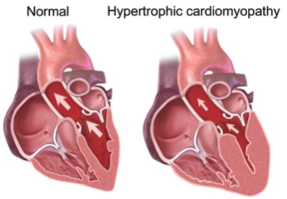

Symptoms include: Shortness of breath, Chest pain, Fainting, Palpitations

## Implantable Cardioverter-Defibrillator (ICD)

::::: columns
::: {.column width="60%"}
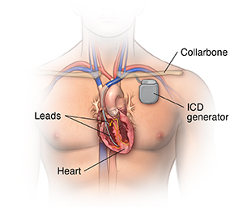
:::

::: {.column width="40%"}
An ICD is a small battery-powered device placed under the skin—usually near the collarbone. It constantly monitors your heart rhythm and delivers life-saving electrical shocks or pacing to correct dangerously fast or irregular heartbeats (arrhythmias), preventing sudden cardiac arrest
:::
:::::


## Previous work

::: {align="center"}
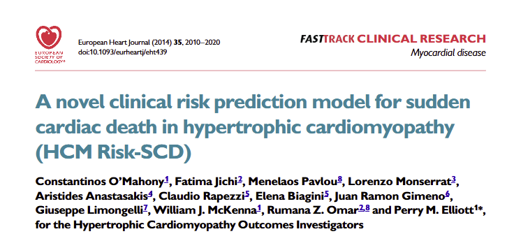
:::

## Problem

- [Hypertrophic cardiomyopathy (HCM)]{style="color: blue;"} is a leading cause of [sudden cardiac death (SCD)]{style="color: blue;"} in young adults. Current risk algorithms provide only a crude estimate of risk and fail to account for the different effect size of individual risk factors. 

- The aim of this study was to develop and validate a new SCD risk prediction model that provides [individualized risk estimates]{style="color: blue;"}.

## Data

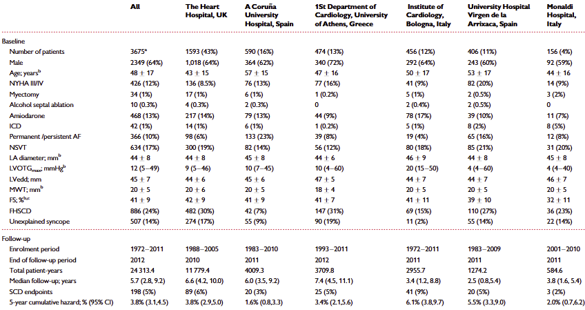

## Results

- The prognostic model was derived from a [retrospective, multi-centre longitudinal cohort study]{style="color: blue;"}. The model was developed from the entire data set using the Cox proportional hazards model and internally validated using bootstrapping.

- The cohort consisted of [3675 patients from six centres]{style="color: blue;"}. During a follow-up period of 24,313 patient-years (median 5.7 years), 198 patients (5%) died suddenly or had an appropriate ICD shock.

- Of eight pre-specified predictors, associated with SCD/appropriate ICD shock at the 15% significance level 
[age, maximal left ventricular wall thickness, left atrial diameter, left ventricular outflow tract gradient, family history of SCD, non-sustained ventricular tachycardia, and unexplained syncope]{style="color: blue;"}

- final model to estimate individual [probabilities of SCD at 5 years]{style="color: blue;"}.
  - For every 16 ICDs implanted in patients with ≥4% 5-year SCD risk, potentially 1 patient will be saved from SCD at 5 years.


## Standard Failure Probability

Define the Prognostic Index (PI) using the coefficients from the standard Cox model

$$
\begin{align*}
\text{PI}_{\text{Naive}} &= 0.159 \times \text{Maximal wall thickness} \\
&\quad - 0.003 \times \text{Maximal wall thickness}^2 \\
&\quad + 0.026 \times \text{Left atrial diameter} \\
&\quad + 0.004 \times \text{Maximal LVOT gradient} \\
&\quad + 0.458 \times \text{Family history SCD} \\
&\quad + 0.826 \times \text{NSVT} \\
&\quad + 0.717 \times \text{Unexplained syncope} \\
&\quad - 0.018 \times \text{Age}
\end{align*}
$$

$$
\begin{equation*}
\hat{P}_{\text{SCD at 5 years}} = 1 - 0.998^{\exp(\text{PI})}
\end{equation*}
$$

## Impact on Decision-Making

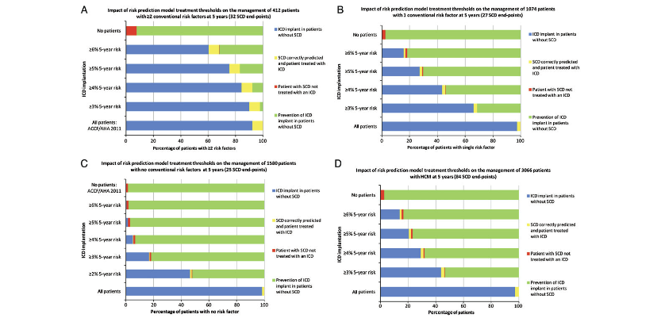

# CE Modelling Using Prediction Model :talking:

## 

::: {align="center"}
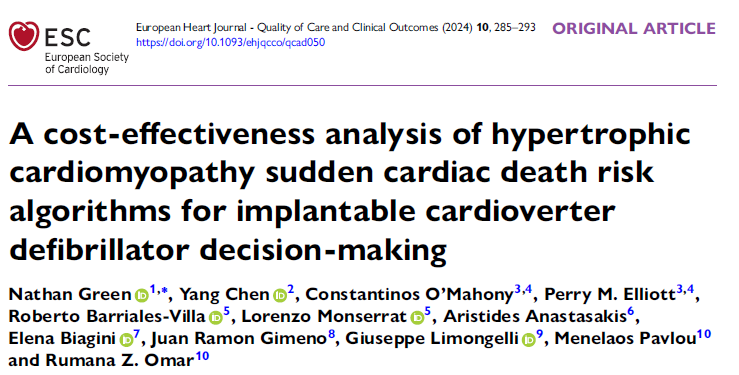
:::

##

#### Aims
- To conduct a contemporary cost-effectiveness analysis examining the use of implantable cardioverter defibrillators (ICDs) for primary prevention in patients with hypertrophic cardiomyopathy (HCM)

#### Methods

- A [discrete-time Markov model]{style="color: blue;"} was used to determine the cost-effectiveness of different ICD decision-making rules for implantation. 
- Several scenarios were investigated, including the reference scenario of implantation rates according to observed real-world practice. 

- A [12-year time horizon]{style="color: blue;"} with an annual cycle length was used. 

- Transition probabilities used in the model were obtained using [Bayesian analysis]{style="color: blue;"}.

## Markov Model

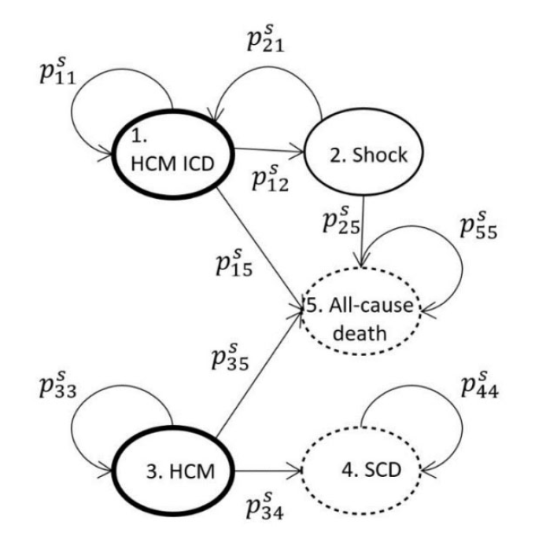

## Input Data

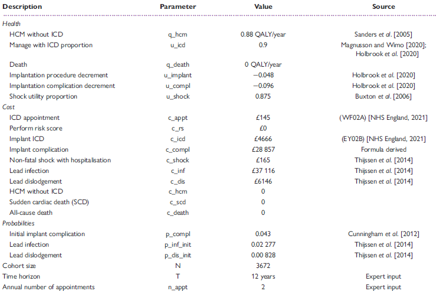

## Transition Probability Matrix

$$
\begin{pmatrix}
p_{11}^s & p_{12}^s & 0 & 0 & p_{15}^s \\
1 - p_{15}^s & 0 & 0 & 0 & p_{15}^s \\
0 & 0 & p_{33} & p_{34}^s & p_{35}^s \\
0 & 0 & 0 & 1 & 0 \\
0 & 0 & 0 & 0 & 1
\end{pmatrix}
$$

## Model Equations

Denote $x$ as the observed number of transitions, $p$ the probability of a transition and $n$ as the total number of transitions from a given state. The hyperparameters $\alpha$ characterise the prior knowledge on $p$. Superscripts indicate the decision rule used.

$$
\begin{align*}
x_{i.}^{(1)} &\sim \text{Multinomial}\left(p_{i.}^{(1)}, n_{i}^{(1)}\right), \quad i = 1, 3 \\
x_{i.}^{(2)} &\sim \text{Multinomial}\left(p_{i.}^{(2)}, n_{i}^{(2)}\right), \quad i = 1, 3 \\[1em]
p_{i.}^{(1)} &\sim \text{Dirichlet}(\alpha^{(1)}), \quad i = 1, 3 \\
p_{i.}^{(2)} &\sim \text{Dirichlet}(\alpha^{(2)}), \quad i = 1, 3
\end{align*}
$$

For all final sink states,

$$
p_{ij}^{(s)} = \begin{cases} 
1 & \text{if } i = j \\ 
0 & \text{if } i \neq j 
\end{cases}
$$

## DAG

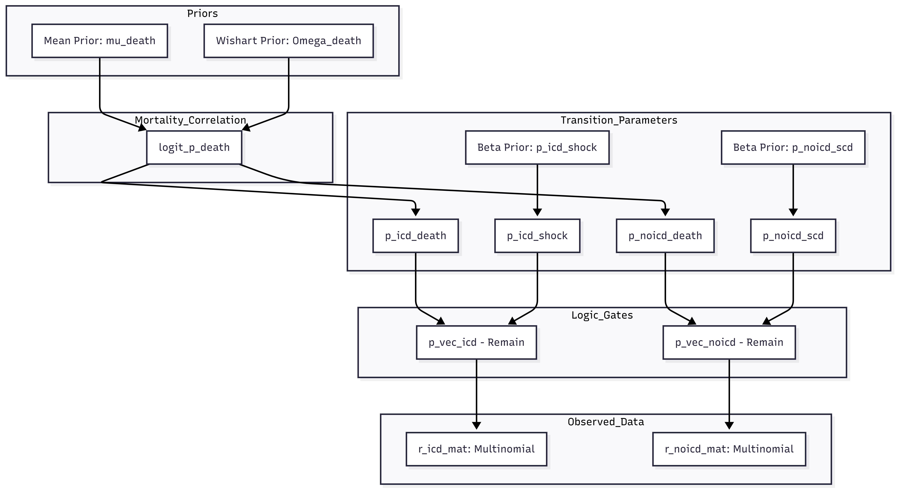

## State Transition Probability Posterior Distributions

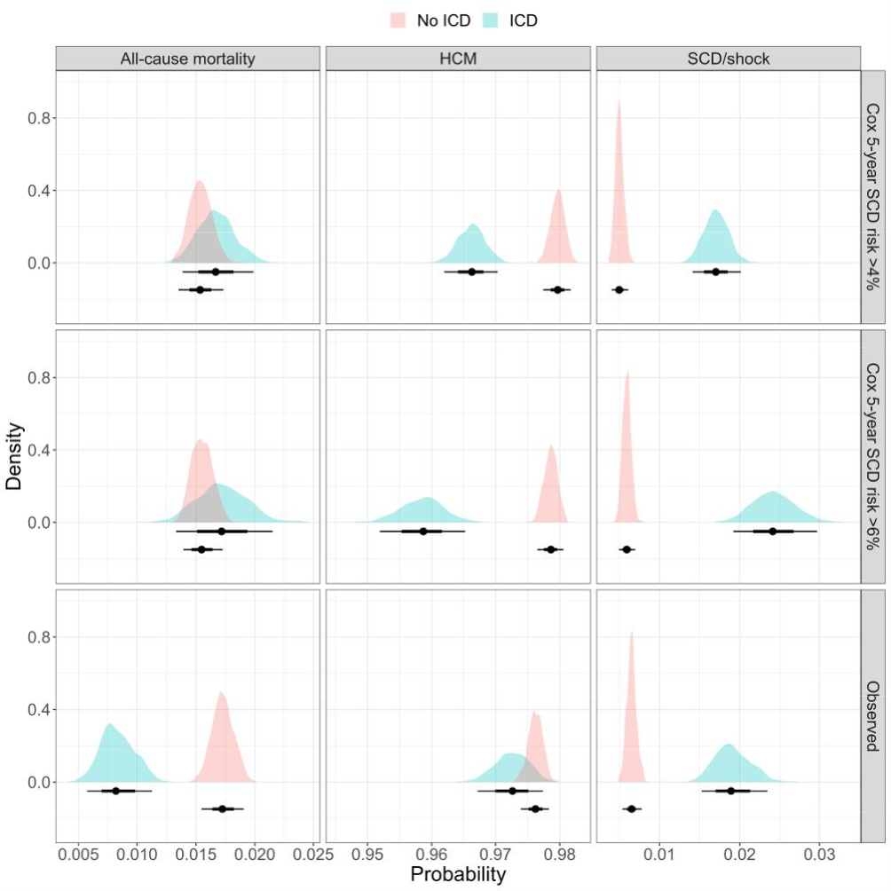

## Trace Plots

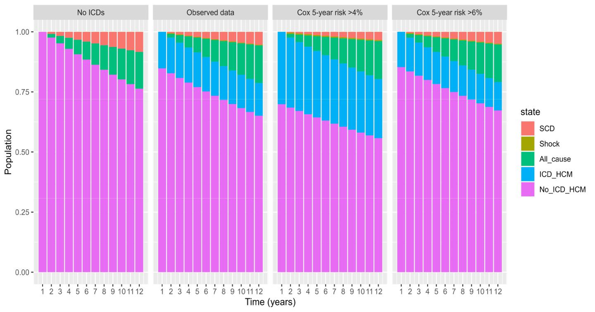

## Cost-Effectiveness Analysis Plots

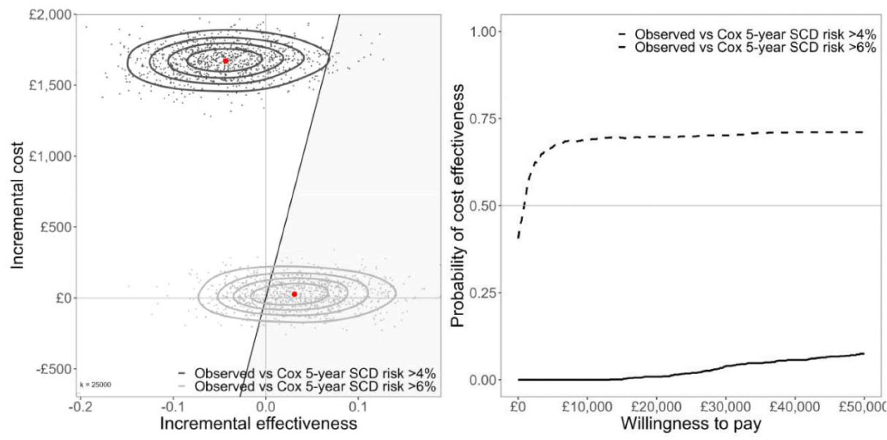

## Deterministic Sensitivity Analysis (DSA)

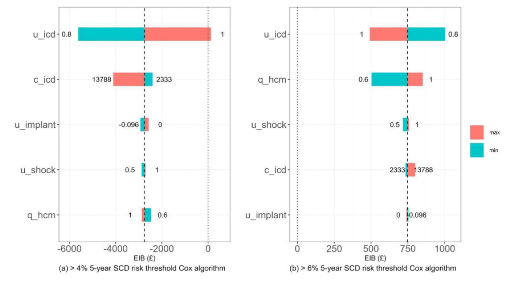

## Global First-Order Variance-Based Probability Sensitivity Analysis

::::: columns
::: {.column width="60%"}
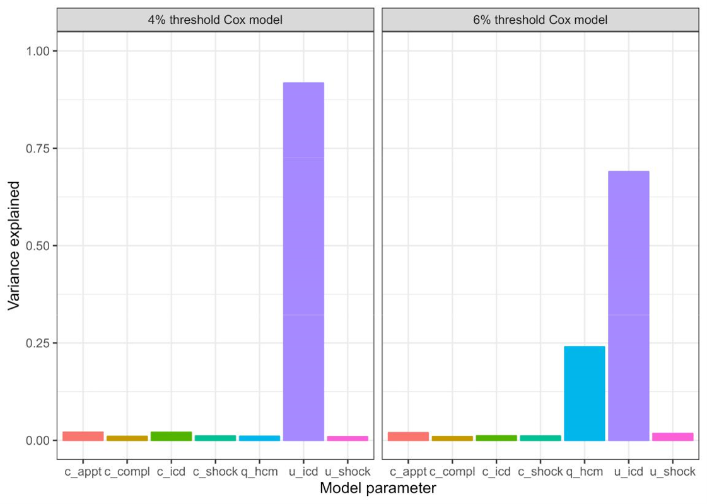
:::

::: {.column width="40%"}
(main effect / first-order Sobol index)

$$
S_i = \frac{V_{X_i}(E_{\mathbf{X}_{\sim i}}(Y \mid X_i))}{V(Y)}
$$

- $Y$ is the model output.
- $X_i$ is the specific input parameter of interest.
- $\mathbf{X}_{\sim i}$ denotes all other input parameters except $X_i$.
- $V(Y)$ is the total unconditional variance of the model output.
:::
:::::

## Cost-Effectiveness Acceptability Curves for ICD Costs

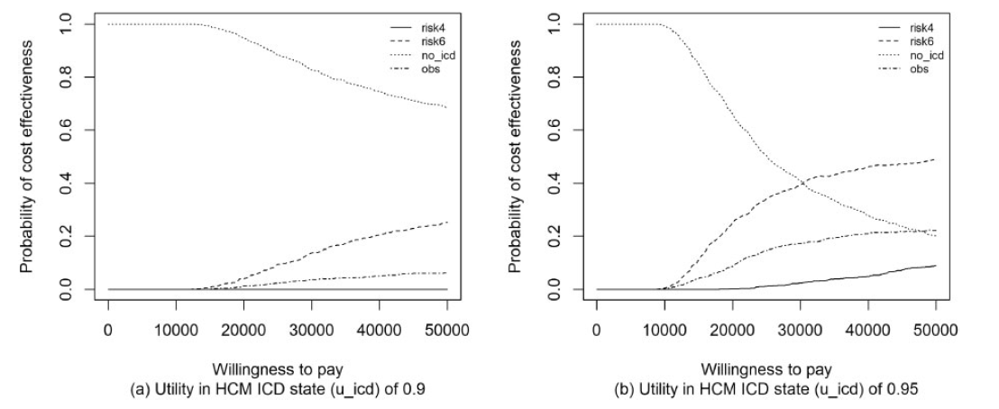


# Current & Future Work

## Subcutaneous ICD (S-ICD)

## Expected Value of Partial Perfect Information (EVPPI)


## Cumulative Incidence Functions (CIFs)

#### Fine-Gray Model (Subdistribution Hazards)

- $\hat{H}_{SCD}(5)$ is the baseline cumulative subdistribution hazard at 5 years.
- $PI_{FG}$ represents the linear predictor re-fitted using a Fine-Gray penalty/weights.

$$
\begin{equation*}
\text{CIF}_{\text{SCD}}^{\text{FG}}(5) = 1 - \exp\left(-\hat{H}_{\text{SCD}}(5) \exp(\text{PI}_{\text{FG}})\right)
\end{equation*}
$$

#### Cause-Specific Model

- Requires the integration of cause-specific hazards for SCD and all other competing events.

::: {style="font-size: 75%;"}
$$
% \hat{h}_{SCD}(t) and \hat{h}_{Other}(t) are the baseline hazards at time t.
% PI_{cs,SCD} and PI_{cs,Other} are the linear predictors from their respective Cox models.
\begin{equation*}
\text{CIF}_{\text{SCD}}^{\text{cs}}(5) = \int_{0}^{5} \hat{h}_{\text{SCD}}(u) \exp(\text{PI}_{\text{cs,SCD}}) \exp\left(-\int_{0}^{u} \left[ \hat{h}_{\text{SCD}}(s) \exp(\text{PI}_{\text{cs,SCD}}) + \hat{h}_{\text{Other}}(s) \exp(\text{PI}_{\text{cs,Other}}) \right] ds\right) du
\end{equation*}
$$
:::

## Congeniality sensitivity in imputation {visibility="hidden"}

::: r-stack
{.fragment width="80%" fig-align="center"}

{.fragment width="80%" fig-align="center"}

{.fragment width="80%" fig-align="center"}
:::


## Conclusions

- The j


## 

# Thanks :thankyou:

## References

<!-- install.packages("pagedown") -->

<!-- pagedown::chrome_print("myslides.html") -->
